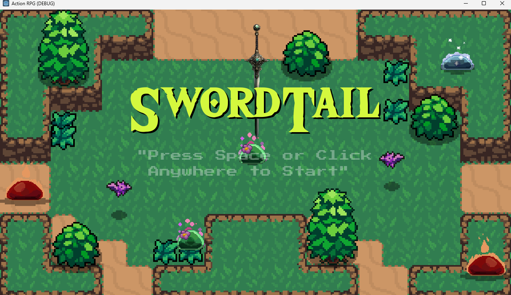
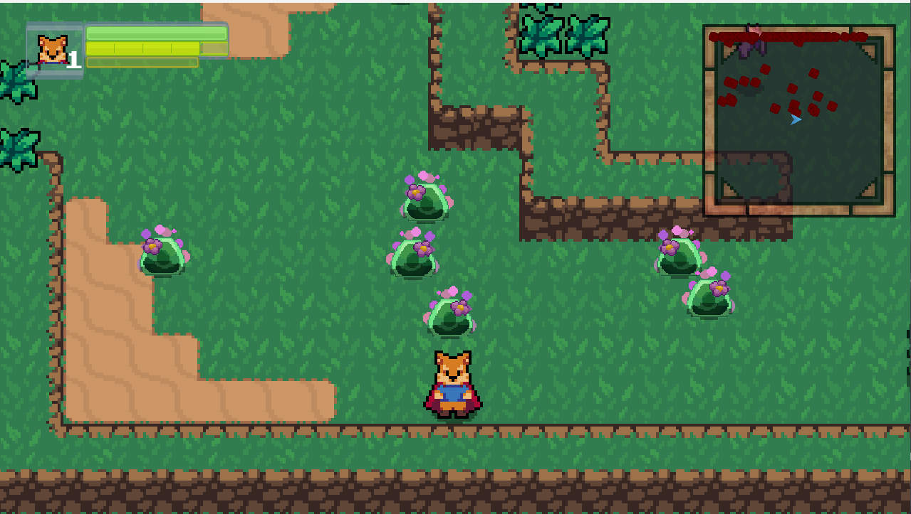
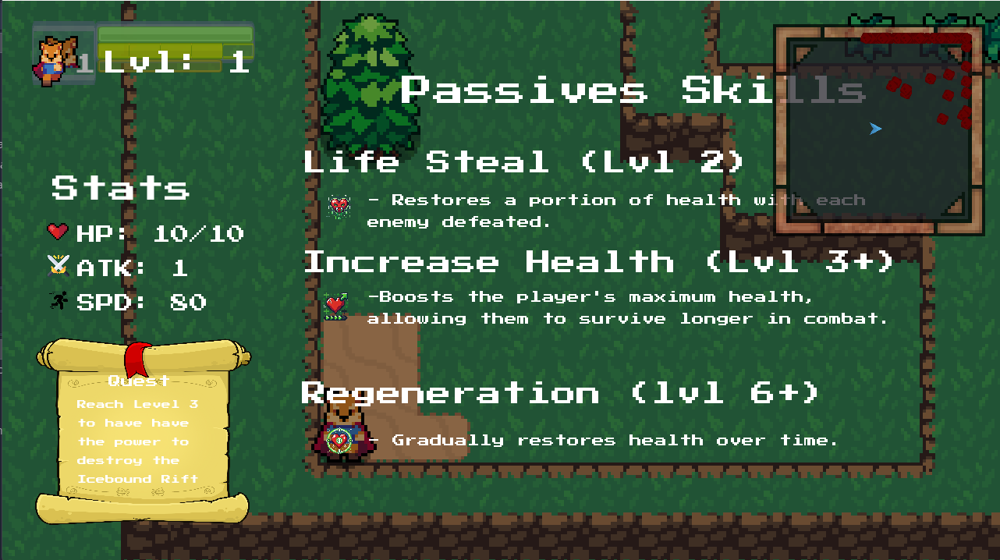

# 🗡️ SwordTail – Action RPG

**SwordTail** is a 2D Action RPG developed in **Godot 3 (GDScript)**.  
The game features fast-paced combat, enemy AI, quests, buffs, multiple worlds, and boss fights.  
It started as a tutorial project and grew into a full RPG with new mechanics, expanded levels, and refined gameplay.

---

## 🚀 Play the Game
🎮 **[Live Demo](https://ianchristophertandog.github.io/SwordTail/)**  
*(Playable directly in your browser via GitHub Pages)*  

---

## 📸 Screenshots
  
  
  

---

## 🎮 Features
- 🧭 **Exploration & Progression**
  - Ice World with slimes and level-restricted ice wall  
  - Lava World with animated lava background, lava slimes, and Worm Boss  
  - World separation using obsidian walls  

- ⚔️ **Combat System**
  - WASD movement + spacebar for melee attacks  
  - Shift to dodge/roll with stamina system  
  - Enemy AI including bats, slimes, and bosses  
  - Attack animations, hitboxes, and combat effects  

- 📊 **Player Stats & Buffs**
  - Health, experience, and stamina system  
  - Level-based buffs (extra HP, life steal, regeneration)  
  - Tab menu for quests, buffs, and stats  

- 🖼️ **UI & Screens**
  - Title screen and Player Died screen  
  - Pause menu with settings  
  - Map toggle (`M` key)  

- 🔧 **Technical Additions**
  - Animation Tree for smooth character animations  
  - YSort node for better scene organization  
  - Light2D effects for atmosphere  

---

## 🎮 Controls
- **Move:** `WASD`  
- **Attack:** `Space`  
- **Dodge/Roll:** `Shift`  
- **Open Quests/Stats/Buffs:** `Tab`  
- **Open/Close Map:** `M`  

---

## 🛠️ Tech Stack
- **Engine:** Godot 3 (GDScript)  
- **Platform:** HTML5 (via Godot export)  
- **Version Control:** Git & GitHub  

---

## 📌 Future Plans
- Add Fire/Lava World boss fight (Fire Slime + new mechanics)  
- Expand quest system and buff progression  
- Improve stamina bar and polish UI  
- Add sound effects and music for immersive gameplay  

---

## 👨‍💻 Author
**Ian Christopher Tandog**  
- [GitHub](https://github.com/IanChristopherTandog)  
- [Portfolio](https://ictandog-portfolio.vercel.app/)  

---

## 📜 License
This project is licensed under the MIT License – feel free to use, modify, and share.
